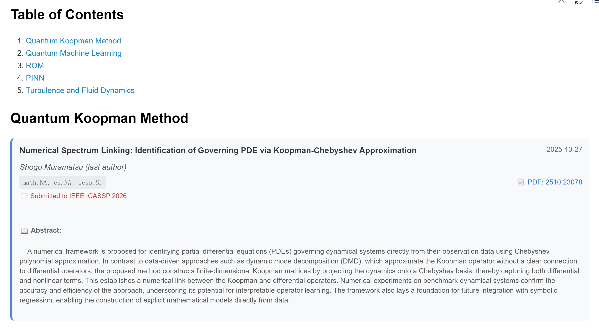

# ArXiv Daily Fetcher

A Python script to **fetch and update arXiv papers** based on user-defined keywords and optional date ranges.  
This project is inspired by [Vincentqyw/cv-arxiv-daily](https://github.com/Vincentqyw/cv-arxiv-daily), with improved configurability, structured logging, and Markdown/HTML output.

---

## Features

- 🔍 **Custom keyword search** – define multiple topics and related filters in YAML.  
- 🗓️ **Flexible date control** – specify a date range or fetch the latest papers.  
- 🧾 **Markdown generation** – auto-generate elegant, structured `.md` reports with optional abstracts.  
  - 📄 *Also supports GitHub Workflow integration to render HTML → PDF and send summary emails automatically.*  
- 🧹 **Smart cleanup** – remove outdated entries or refresh content for a specific time window.  

---

## Installation

```bash
pip install -r requirements.txt # python 3.10
```

## Example

```bash
python arxiv-daily.py --config_path config.yaml
```

The workflow file `.github/workflows/arxiv-daily.yml` enables **scheduled automation** — it can automatically fetch the latest arXiv papers, generate Markdown and PDF reports, and **send the resulting PDF summary to your email inbox on a regular schedule**.

The resulting PDF report is visually formatted for readability and presentation, similar to the example shown below


